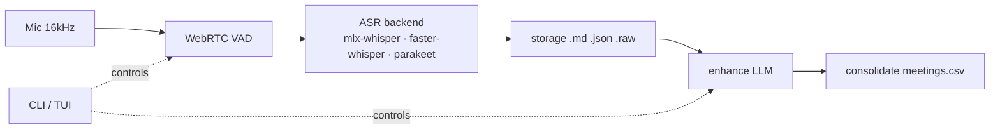

<h1 align="center">🎙️ podscribe</h1>

<p align="center">
  <strong>Local-first live transcription for 1:1s and team meetings.</strong><br>
  <em>Built for managers running multiple pods. On-device, private, agentic.</em>
</p>

<p align="center">
  <code>mic → VAD → mlx-whisper → markdown · fully on your machine · no cloud</code>
</p>

<p align="center">
  
  
  
  
  
  
  
</p>

---

> **You manage 12 reports across 4 teams.** Every 1:1 starts with "how are you," runs through 10 minutes of project updates, and ends with the three action items you're *supposed* to remember.

> Podscribe sits in the middle of that loop: it captures the conversation locally, cleans up the transcript with an LLM, extracts structured fields into a CSV, and — when you ask — runs an agentic loop over everything it knows. No SaaS. No audio leaving your laptop. No transcripts committed to git.

> **Privacy by design. Agentic by default. Apple-Silicon fast.**

> **Upgrade note (continuous audio):** recordings now keep *continuous* `.raw`
> audio (silence included) to enable diarization. Disk grows most for
> **silence-heavy meetings** (long sessions with lots of dead air, up to ~5–10×);
> **talkative meetings are barely affected** (≈1×). Use `--no-keep-audio` to skip
> saving audio entirely.

---

## 📑 Contents

- [Highlights](#-highlights) · [How it works](#-how-it-works) · [Quick start](#-quick-start)
- [The flow](#-the-flow) · [Knowledge-Transfer videos](#-knowledge-transfer-videos) · [Benchmarks](#-benchmarks)
- [Commands](#-commands) · [TUI](#-tui)
- [Storage layout](#-storage-layout) · [Models & backends](#-models--backends) · [Cross-platform backends](#cross-platform-backends)
- [LLM config](#-llm-config) · [Providers](#-providers) · [VAD tuning](#-vad-tuning)
- [Privacy](#-privacy) · [Troubleshooting](#-troubleshooting) · [Project structure](#-project-structure) · [Tests](#-tests)

---

## ✨ Highlights

<table>
  <tr>
    <td width="50%" valign="top">
      <h3>🔒 Private by design</h3>
      <p>All transcription runs on-device — <strong>no cloud, no network calls</strong> during <code>record</code>. The LLM <code>enhance</code>/<code>consolidate</code>/<code>god</code> pipeline defaults to local Ollama; any OpenAI-compatible endpoint (Groq, OpenRouter, DeepSeek, GLM, Kimi, …) is opt-in. <code>pods/</code> is gitignored — transcripts never leave your machine.</p>
    </td>
    <td width="50%" valign="top">
      <h3>🤖 Agentic god-mode</h3>
      <p>An agent with <strong>20+ tools</strong> records, enhances, consolidates, and searches on your behalf. Ask <em>"what did Sam say about the API last week?"</em> and it does the work.</p>
    </td>
  </tr>
  <tr>
    <td width="50%" valign="top">
      <h3>⚡ Cross-platform ASR</h3>
      <p>Pluggable backends: <code>mlx-whisper</code> on Apple Silicon, <code>faster-whisper</code> on NVIDIA CUDA (or CPU int8), optional <code>parakeet</code> on both. One CLI, three platforms.</p>
    </td>
    <td width="50%" valign="top">
      <h3>🧪 Battle-tested</h3>
      <p><strong>600+ offline tests</strong> — no mic, no model download, no network. <code>pip install -e . && pytest</code> just works out of the box.</p>
    </td>
  </tr>
  <tr>
    <td width="50%" valign="top">
      <h3>🗂️ Pod-isolated storage</h3>
      <p>One team, one <code>pods/&lt;name&gt;/</code> tree. Per-pod glossaries, configs, rollups, and raw audio (kept for future diarization).</p>
    </td>
    <td width="50%" valign="top">
      <h3>📝 Incremental & crash-safe</h3>
      <p>Transcript is written one segment at a time. A crash loses <strong>at most one segment</strong> — the meeting in flight is still readable.</p>
    </td>
  </tr>
</table>

---

## 📊 How it works



> VAD (Voice Activity Detection) acts as an audio *"traffic controller"*, filtering background noise and only sending actual human speech to the transcription model.

See [`docs/ARCHITECTURE.md`](docs/ARCHITECTURE.md) for the module-level diagram.

---

## 🚀 Quick start

Requires Python 3.10+ and a working microphone. The ASR engine is a
platform-specific extra, so pick the one for your hardware:

```bash
xcode-select --install          # macOS only, for the webrtcvad C extension

git clone <repo>
cd podscribe
python3 -m venv .venv && source .venv/bin/activate   # Windows: .venv\Scripts\activate

pip install -e '.[mlx]'         # Apple Silicon  — Whisper via mlx-whisper (or parakeet: .[parakeet-mlx])
pip install -e '.[cuda]'        # NVIDIA / CUDA  — Whisper via faster-whisper (or parakeet: .[parakeet-cuda])
                                # CPU-only install? .[cuda] works too — int8 fallback, no GPU needed

cp podscribe.yaml.example podscribe.yaml
cp leadership_team.yaml.example leadership_team.yaml
# edit leadership_team.yaml — add your team's names
# edit podscribe.yaml — set your LLM model (local Ollama by default;
#   see "Providers" to point at an OpenAI-compatible endpoint instead)
```

Then:

```bash
podscribe init sam-chen --display-name "Sam Chen" --role "Senior Engineer"
podscribe record sam-chen          # Ctrl+C or 's' to stop
podscribe show sam-chen latest
```

---

## 🛤️ The flow

```
record  →  enhance  →  consolidate
```

| step | what it does | requires |
|---|---|---|
| `record` | live mic → VAD → Whisper → `.md` transcript, crash-safe | mic, mlx-whisper |
| `enhance` | LLM cleanup pass → `.md` summary in `summaries/` | an LLM provider |
| `consolidate` | extract structured fields → row in `meetings.csv` | an LLM provider, enhanced summary |

Each step is independent. Run only what you need.

---

## 📹 Knowledge-Transfer videos

Ingest external video tutorials, demos, and knowledge-transfer sessions into a pod alongside live meetings. The `.vtt` or `.srt` transcript file (often included with downloaded videos) is the **source of truth**; optionally force local transcription with `--asr`.

```
ingest  →  enhance --kt  →  ask
```

| step | what it does | requires |
|---|---|---|
| `ingest <video>` | video + sibling `.vtt`/`.srt` → KT session | sibling transcript file (or `--asr` + ffmpeg for ASR path) |
| `enhance --kt` | LLM summary of KT session → `summaries/` | an LLM provider |
| `ask <id>` | Q&A grounded in ONE KT transcript | none (text-only) |

Each KT session lives in `pods/<pod>/kt/` — separate from meetings. The `--asr` path forces local mlx-whisper transcription, creates a coexisting session, and never overwrites a `.vtt`-derived one.

**Example workflow (with bundled transcript):**

```bash
podscribe fso ingest ~/Downloads/auth-kt.mp4            # auto-finds auth-kt.vtt as source
podscribe fso show --kt latest                          # read the transcript
podscribe fso enhance --kt latest                       # generate LLM summary
podscribe fso ask latest "what are the open questions?" # Q&A on this session only
```

**Example workflow (ASR path):**

```bash
podscribe fso ingest ~/Downloads/another-kt.mp4 --asr --model large-v3-turbo
# creates a separate KT session, transcribed locally (ffmpeg required on PATH)
```

**Note:** ffmpeg is required **only** for the `--asr` path (and the bundled benchmark harness); if you use a sibling `.vtt`/`.srt`, no external tools are needed.

---

## 📈 Benchmarks

The bundled Whisper models are benchmarked on real audio for speed (RTF) and
quality (WER, CER, MER, WIL, WIP). See [`docs/BENCHMARKS.md`](docs/BENCHMARKS.md)
for the full table, per-clip breakdown, methodology, and reproduction instructions.

| Model            | Mean RTF | Mean WER |
|------------------|----------|----------|
| `base`           | 0.009    | 0.132    |
| `large-v3-turbo` | 0.047    | 0.098    |

Apple Silicon · on-device · reproducible via `python benchmarks/bench_transcribe.py`.

- [LLM Enhance Evaluations](docs/EVALS.md) — methodology, results, caveats.

---

## ⌨️ Commands

Podscribe uses a **pod-first** syntax (`podscribe <pod> <command>`) — `podscribe sam-chen record` is the same as `podscribe record sam-chen`. Aliases: `start`→`record`, `summarize`→`enhance`, `cons`→`consolidate`.

| command | one-liner |
|---|---|
| `init <name>` | create a pod (kebab-case; `--display-name`, `--role`, `--cadence`, `--notes`) |
| `record` | live mic → VAD → Whisper → `.md` transcript (Ctrl+C / `s` to stop) |
| `list` | meetings table (`--all`, `--since 7d`, `--recent N`, `--type 1on1`, `--kt`) |
| `show <id\|latest>` | print a transcript (`--kt` for KT sessions) |
| `search <query>` | fixed-string search across transcripts (`--pod`, `--since`, `--type`, `--color`, `--kt`) |
| `enhance` | LLM cleanup → `summaries/<id>.md` (alias `summarize`; `--kt` for KT) |
| `consolidate` | structured fields → `meetings.csv` row (alias `cons`; needs `enhance` first) |
| `ingest <video>` | KT video + sibling `.vtt`/`.srt` → KT session (`--asr` forces local Whisper) |
| `ask <id\|latest>` | Q&A grounded in one KT transcript |
| `diarize` | post-hoc speaker diarization → `.diarized.md` (needs continuous `.raw`) |
| `god [prompt]` | agentic mode: 20+ tools, REPL or one-shot |
| `context` | glossary add/remove/list (merges `leadership_team.yaml` + per-pod) |
| `export` / `import` | tar.gz backup / restore of `pods/` + root YAMLs |
| `config llm\|consolidate\|god` | project-level config (`--provider`, `--base-url`, `--api-key-env`) |

Full flag reference, the interactive **TUI** keymap, and the **god-mode** tool list live in the [`docs/USER-MANUAL.md`](docs/USER-MANUAL.md).

---

## 🖥️ TUI

Running `podscribe` at a TTY opens the two-pane modal interface:

```
SCREEN 1  —  NORMAL MODE  ·  DASHBOARD VIEW
┌─ PODS ──────┐ ┌─ Dashboard ──────────────────────────────────────┐
│ ▶ sam-chen  │ │ Sam Chen  ·  Senior Engineer  ·  weekly          │
│   alex-tan  │ │                                                  │
│   priya-k   │ │  TOTAL MEETINGS   ENHANCED       LAST MET        │
│             │ │  12               9  75%          3d ago         │
│             │ │                                                  │
│             │ │  RECENT MEETINGS                                 │
│             │ │  ▶  2026-06-27 14:02  [1on1]   42m  ✓ enhanced   │
│             │ │     2026-06-20 09:15  [1on1]   38m  → raw        │
└─────────────┘ └──────────────────────────────────────────────────┘
 NORMAL   sam-chen  ·  12 meetings  ·  last 3d ago
```

**God mode** (`podscribe god`) is a two-pane agentic REPL — left = conversation, right = tool call log. The agent has 20+ tools and access to all pod data. Full keymap and god-mode tool list: [`docs/USER-MANUAL.md`](docs/USER-MANUAL.md).

---

## 📂 Storage layout

One tree per pod: `pods/<name>/{config.yaml, meetings.csv, transcripts/, summaries/, kt/}`. Meeting ID format: `YYYY-MM-DD-HHMMSS-<pod>`. Transcripts (`[HH:MM:SS] text`) and `.raw` audio are written incrementally; summaries land in `summaries/`. Full tree + 2-level/3-level layout note: [`docs/USER-MANUAL.md`](docs/USER-MANUAL.md#file-structure).

---

## 🧩 Models & backends

Default: `large-v3-turbo` (~500 MB, cached in `~/.cache/huggingface/` after first use).

| short name | HuggingFace path |
|---|---|
| `base` | `mlx-community/whisper-base-mlx` |
| `turbo` | `mlx-community/whisper-large-v3-turbo` |
| `large-v3-turbo` | `mlx-community/whisper-large-v3-turbo` |

Any other value passes through to the backend unchanged — full HF paths work.

### Cross-platform backends

`Transcriber` is a facade over pluggable ASR engines in `podscribe/backends/`. `--backend auto` (default) picks by `(model, platform)`; you can also pin one with `--backend <name>`.

| `--backend` | extra | platform | engine | notes |
|---|---|---|---|---|
| `whisper-mlx` | `.[mlx]` | Apple Silicon | `mlx-whisper` | default on arm64 macOS |
| `whisper-faster` | `.[cuda]` | NVIDIA / CPU | `faster-whisper` (CTranslate2) | default on x86_64; CUDA int8/fp8 on GPU, CPU int8 fallback |
| `parakeet-mlx` | `.[parakeet-mlx]` | Apple Silicon | `parakeet-mlx` | optional; fast TDT Bean model |
| `parakeet-nemo` | `.[parakeet-cuda]` | NVIDIA | `nemo_toolkit[asr]` | optional |

**Windows CUDA note.** On Windows, `.[cuda]` also pulls `nvidia-cublas-cu12` / `nvidia-cudnn-cu12` wheels — CTranslate2 doesn't bundle the CUDA 12 runtime there, and `_add_cuda_dll_dirs()` adds those wheels' DLLs to the loader search path at model-load time. Verified on an RTX 5090 (Blackwell sm_120).

**CPU fallback.** If CUDA can't initialize, `whisper-faster` emits a `RuntimeWarning` and falls back to CPU int8 (slower) rather than failing — check for that warning if GPU transcription seems slow.

---

## 🔧 LLM config

Lives in `podscribe.yaml` (project-level) or per-pod `config.yaml`. Pod-level takes precedence.

```yaml
llm:
  provider: ollama              # "ollama" (default) or "openai" (any OpenAI-compatible endpoint)
  model: qwen2.5:7b
  base_url: http://localhost:11434   # omit for default Ollama; required for provider: openai
  api_key_env: OPENAI_API_KEY        # env-var NAME (not the key) — openai provider only
  preserve_speakers: true        # default true; prepends speaker-preservation preamble
  prompt_template: |
    You are cleaning up a raw meeting transcript. {{glossary}}
    Fix punctuation, remove filler, preserve speaker names.
    Transcript: {{transcript}}
```

`consolidate` uses a separate prompt under `consolidate.prompt` (supports `{{summary}}`).  
`god` uses `god.model`, falling back to `llm.model`.

---

## 🌐 Providers

The `enhance` / `consolidate` / `god` / `enhance --kt` / `summarize` pipeline talks to a pluggable provider resolved from the `llm` config. Two are built in:

| `provider` | wire | notes |
|---|---|---|
| `ollama` (default) | native `/api/generate`, `/api/chat`, `/api/show` | zero-config local; `ollama serve` at `localhost:11434` |
| `openai` | OpenAI-compatible `/v1/chat/completions` (SSE streaming) | requires `base_url`; auth via `api_key_env` (an env-var **name**) |

The `openai` provider speaks the OpenAI chat schema, so any of these work by pointing `--base-url` at them:

| service | example `--base-url` |
|---|---|
| OpenAI | `https://api.openai.com/v1` |
| Groq | `https://api.groq.com/openai/v1` |
| OpenRouter | `https://openrouter.ai/api/v1` |
| DeepSeek | `https://api.deepseek.com/v1` |
| GLM (Zhipu) | `https://open.bigmodel.cn/api/paas/v4` |
| Kimi (Moonshot) | `https://api.moonshot.cn/v1` |
| Minimax | `https://api.minimax.chat/v1` |
| Qwen (DashScope) | `https://dashscope.aliyuncs.com/compatible-mode/v1` |
| LM Studio | `http://localhost:1234/v1` |
| vLLM | `http://localhost:8000/v1` |
| Ollama `/v1` shim | `http://localhost:11434/v1` |

**Quick switch** — point the project at a hosted model without touching YAML:

```bash
export GROQ_API_KEY=...
podscribe config llm set llama3.1:70b "$PROMPT" --provider openai --base-url https://api.groq.com/openai/v1 --api-key-env GROQ_API_KEY
podscribe enhance <pod> latest
```

Privacy: with `provider: ollama` nothing leaves your machine. With `provider: openai` the transcript text is sent to the configured `base_url` — choose accordingly.

---

## 🎚️ VAD tuning

`--vad-aggressiveness` controls the silence detector:

| value | behaviour |
|---|---|
| `0` | very loose — passes noise, more false segments |
| `1` | loose |
| `2` | **default** — balanced |
| `3` | strict — clear speech only; may clip soft-spoken starts |

Start at `2`. Garbage/hallucinated segments on pauses → raise to `3`. Words clipped at sentence starts → lower to `1`.

---

## 🔐 Privacy

- **All processing local.** No network calls during `record` or `enhance`.
- **Raw audio kept by default** for future diarization. Use `--no-keep-audio` to delete.
- **Config files are gitignored.** `podscribe.yaml` and `leadership_team.yaml` contain real names and personal settings. Copy from the `.example` files to set up.
- **`pods/` is gitignored.** Transcripts and summaries never leave your machine.

---

## 🩺 Troubleshooting

**`No module named webrtcvad`** — `xcode-select --install` then `pip install webrtcvad`.  
**`No module named sounddevice`** — `pip install sounddevice`. Linux may need `portaudio19-dev`.  
**Model download slow** — first run fetches ~500 MB. Cached after that.  
**Choppy transcript** — try `--vad-aggressiveness 3`.  
**Hallucinations on pauses** — VAD too loose; raise aggressiveness.  
**Wrong input device** — `python -c "import sounddevice; print(sounddevice.query_devices())"` then `--device N`.  
**Crashed mid-meeting** — transcript is written incrementally; run `podscribe show <pod> latest`.  
**LLM provider not reachable** — `enhance`, `consolidate`, and `god` need a reachable LLM. Default: `ollama serve` at `localhost:11434`. For `provider: openai`, check your `--base-url` and that the env var named by `--api-key-env` is exported.

---

## 🗺️ Project structure

Single-package layout, no nested packages — every module has one job. See [`AGENTS.md`](AGENTS.md) for the full module map (every file + one-line purpose) and [`docs/ARCHITECTURE.md`](docs/ARCHITECTURE.md) for the system diagram.

---

## 🧪 Tests

```bash
pytest tests/ -v                      # all tests (600+; count varies with installed engines)
pytest tests/ -k "not transcriber"    # skip the network smoke test (recommended for CI)
pytest tests/test_storage.py -v       # single file
pytest tests/ -k "test_init_pod" -v   # single test by name
```

Offline tests need no mic, model, or network. The single smoke test (`test_transcriber_accepts_initial_prompt`) downloads a real Whisper model; `test_diarize_smoke` needs an HF token.

---

<p align="center">
  <em>Built for the 12-reports-weekly grind. Local-first, agentic, Apple-Silicon fast.</em><br>
  <sub>MIT License</sub>
</p>