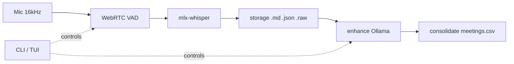

<h1 align="center">🎙️ podscribe</h1>

<p align="center">
  <strong>Local-first live transcription for 1:1s and team meetings.</strong><br>
  <em>Built for managers running multiple pods. On-device, private, agentic.</em>
</p>

<p align="center">
  <code>mic → VAD → mlx-whisper → markdown · fully on your machine · no cloud</code>
</p>

<p align="center">
  
  
  
  
  
  
  
</p>

---

> **You manage 12 reports across 4 teams.** Every 1:1 starts with "how are you," runs through 10 minutes of project updates, and ends with the three action items you're *supposed* to remember.

> Podscribe sits in the middle of that loop: it captures the conversation locally, cleans up the transcript with an LLM, extracts structured fields into a CSV, and — when you ask — runs an agentic loop over everything it knows. No SaaS. No audio leaving your laptop. No transcripts committed to git.

> **Privacy by design. Agentic by default. Apple-Silicon fast.**

> **Upgrade note (continuous audio):** recordings now keep *continuous* `.raw`
> audio (silence included) to enable diarization. Disk grows most for
> **silence-heavy meetings** (long sessions with lots of dead air, up to ~5–10×);
> **talkative meetings are barely affected** (≈1×). Use `--no-keep-audio` to skip
> saving audio entirely.

---

## ✨ Highlights

<table>
  <tr>
    <td width="50%" valign="top">
      <h3>🔒 Private by design</h3>
      <p>All transcription runs on-device. <strong>No cloud, no network calls</strong> during record or enhance. <code>pods/</code> is gitignored — transcripts never leave your machine.</p>
    </td>
    <td width="50%" valign="top">
      <h3>🤖 Agentic god-mode</h3>
      <p>An agent with <strong>20+ tools</strong> records, enhances, consolidates, and searches on your behalf. Ask <em>"what did Sam say about the API last week?"</em> and it does the work.</p>
    </td>
  </tr>
  <tr>
    <td width="50%" valign="top">
      <h3>⚡ Apple-Silicon optimized</h3>
      <p>Backed by <code>mlx-whisper</code> (MLX) and WebRTC VAD. Runs in real time on a MacBook, no GPU rig required.</p>
    </td>
    <td width="50%" valign="top">
      <h3>🧪 Battle-tested</h3>
      <p><strong>357 offline tests</strong> — no mic, no model download, no network. <code>pip install -e . && pytest</code> just works out of the box.</p>
    </td>
  </tr>
  <tr>
    <td width="50%" valign="top">
      <h3>🗂️ Pod-isolated storage</h3>
      <p>One team, one <code>pods/&lt;name&gt;/</code> tree. Per-pod glossaries, configs, rollups, and raw audio (kept for future diarization).</p>
    </td>
    <td width="50%" valign="top">
      <h3>📝 Incremental & crash-safe</h3>
      <p>Transcript is written one segment at a time. A crash loses <strong>at most one segment</strong> — the meeting in flight is still readable.</p>
    </td>
  </tr>
</table>

---

## 📊 How it works



> VAD (Voice Activity Detection) acts as an audio *"traffic controller"*, filtering background noise and only sending actual human speech to the transcription model.

See [`docs/ARCHITECTURE.md`](docs/ARCHITECTURE.md) for the module-level diagram.

---

## 🚀 Quick start

Requires Python 3.10+, Xcode Command Line Tools, and a working microphone.

```bash
xcode-select --install          # once, for the webrtcvad C extension

git clone <repo>
cd podscribe
python3 -m venv .venv && source .venv/bin/activate
pip install -e .

cp podscribe.yaml.example podscribe.yaml
cp leadership_team.yaml.example leadership_team.yaml
# edit leadership_team.yaml — add your team's names
# edit podscribe.yaml — set your Ollama model
```

Then:

```bash
podscribe init sam-chen --display-name "Sam Chen" --role "Senior Engineer"
podscribe record sam-chen          # Ctrl+C or 's' to stop
podscribe show sam-chen latest
```

---

## 🛤️ The flow

```
record  →  enhance  →  consolidate
```

| step | what it does | requires |
|---|---|---|
| `record` | live mic → VAD → Whisper → `.md` transcript, crash-safe | mic, mlx-whisper |
| `enhance` | LLM cleanup pass → `.md` summary in `summaries/` | Ollama |
| `consolidate` | extract structured fields → row in `meetings.csv` | Ollama, enhanced summary |

Each step is independent. Run only what you need.

---

## 📈 Benchmarks

The bundled Whisper models are benchmarked on real audio for speed (RTF) and
quality (WER, CER, MER, WIL, WIP). See [`docs/BENCHMARKS.md`](docs/BENCHMARKS.md)
for the full table, per-clip breakdown, methodology, and reproduction instructions.

| Model            | Mean RTF | Mean WER |
|------------------|----------|----------|
| `base`           | 0.009    | 0.132    |
| `large-v3-turbo` | 0.047    | 0.098    |

Apple Silicon · on-device · reproducible via `python benchmarks/bench_transcribe.py`.

---

## ⌨️ Commands

```
podscribe                              # TUI launcher (TTY only)
podscribe god [prompt]                 # agentic mode · 20+ tools · REPL or one-shot
```

### pod management

```
podscribe init <name>                  # kebab-case name, e.g. sam-chen
  --display-name "Sam Chen"
  --role "Senior Engineer"
  --cadence weekly
  --notes "private notes"

podscribe list                         # all pods · all meetings
podscribe list <pod>                   # one pod
podscribe list --all                   # uses global pods/meetings.csv
podscribe list --since 7d              # last 7 days  (also: 24h · 2026-06-15)
podscribe list --recent 5              # N most recent
podscribe list --type 1on1             # filter by type
```

### recording

```
podscribe record <pod>                 # alias: start
  --model large-v3-turbo               # default; see Models below
  --vad-aggressiveness 2               # 0 loose → 3 strict; default 2
  --device N                           # input device index
  --no-keep-audio                      # delete .raw after recording (default: keep)
  --type 1on1                          # optional; creates type/ subdir

podscribe <pod> record                 # pod-first syntax also works
```

Press `s` or Ctrl+C to stop. Transcript is written incrementally — a crash loses at most one segment.

### reading

```
podscribe show <pod> latest
podscribe show <pod> 2026-06-22        # ID prefix
podscribe search "Project Atlas"       # all pods · fixed-string match
podscribe search "auth" --pod sam-chen
podscribe search "blocker" --since 7d
podscribe search "x" --type 1on1 --color
```

Search uses `rg` if on PATH, falls back to Python. Output: `pod:DD-MMM-YYYY:<id>:[HH:MM:SS] line`.

### LLM pipeline

```
podscribe enhance <pod>                # alias: summarize · defaults to latest
podscribe enhance <pod> <id-prefix>
podscribe consolidate <pod>            # alias: cons · requires enhanced summary
podscribe consolidate <pod> <id-prefix> --no-log   # skip CSV update
```

Requires `ollama serve` at `http://localhost:11434`.

### `diarize`

Post-hoc speaker diarization for a recorded meeting. Requires `pyannote.audio` and a HuggingFace token.

```bash
pip install -e ".[diarize]"            # opt-in extra (torch, pyannote.audio)
podscribe diarize <pod> [meeting]      # meeting ID prefix or "latest" (default)
podscribe diarize <pod> --num-speakers 2   # pin a speaker count
podscribe diarize <pod> --cpu               # force CPU (default: Apple MPS/Metal when available)
podscribe diarize <pod> --relogin           # re-prompt for HF token
```

**First-run HF token.** Accept the model license at
`huggingface.co/pyannote/speaker-diarization-community-1` (the pipeline may prompt
for a few gated sub-models on first download — accept each), then create a read
token at `huggingface.co/settings/tokens`. First `diarize` run in a TTY prompts
for it, saved to `~/.config/podscribe/hf_token` (mode 0o600). `$HF_TOKEN` overrides.

**Output.** Writes a `.diarized.md` sidecar; `show`/`enhance` prefer it. Labels are
generic (`Speaker 0`, `Speaker 1`, …). Only meetings recorded with continuous
audio (this version onward) can be diarized — older recordings are refused.

### context (glossary)

```
podscribe context <pod> add "Alice Smith" --category person
podscribe context <pod> add "Project Atlas" --category project
podscribe context <pod> remove "Alice Smith"
podscribe context <pod> list
```

Glossary terms are injected as Whisper `initial_prompt` during `record` and embedded in the LLM prompt during `enhance`/`consolidate`. Effective glossary = `leadership_team.yaml` (global) + per-pod `config.yaml`.

### config

```
podscribe config llm show
podscribe config llm set <model> <prompt-template>
podscribe config consolidate show
podscribe config consolidate set <prompt>
podscribe config god show
podscribe config god set <model>
```

### backup

```
podscribe export --out pods-backup.tar.gz
podscribe export --out -                          # stdout
podscribe import pods-backup.tar.gz
podscribe import --force pods-backup.tar.gz       # overwrite existing pods
podscribe import --dry-run pods-backup.tar.gz     # show, don't write
```

`export` bundles `pods/`, `leadership_team.yaml`, `podscribe.yaml`. Excludes `.raw`, `.env`, `__pycache__/`, `.venv/`. `import` skips `podscribe.yaml` to preserve local LLM config.

---

## 🖥️ TUI

Running `podscribe` at a TTY opens the two-pane modal interface:

```
SCREEN 1  —  NORMAL MODE  ·  DASHBOARD VIEW
┌─ PODS ──────┐ ┌─ Dashboard ──────────────────────────────────────┐
│ ▶ sam-chen  │ │ Sam Chen  ·  Senior Engineer  ·  weekly          │
│   alex-tan  │ │                                                  │
│   priya-k   │ │  TOTAL MEETINGS   ENHANCED       LAST MET        │
│             │ │  12               9  75%          3d ago         │
│             │ │                                                  │
│             │ │  RECENT MEETINGS                                 │
│             │ │  ▶  2026-06-27 14:02  [1on1]   42m  ✓ enhanced   │
│             │ │     2026-06-20 09:15  [1on1]   38m  → raw        │
└─────────────┘ └──────────────────────────────────────────────────┘
 NORMAL   sam-chen  ·  12 meetings  ·  last 3d ago
```

| key | action |
|---|---|
| `j` / `k` | move down / up |
| `Tab` | switch pane (PODS ↔ main) |
| `r` | record new meeting |
| `e` | enhance selected meeting |
| `c` | consolidate selected meeting |
| `Enter` | view transcript |
| `/` | search |
| `:` | command palette |
| `q` | quit |

Status bar colour: **lilac** = NORMAL · **pink** = recording/streaming · **peach** = command palette.

---

## 🧠 God mode

```
podscribe god                          # interactive REPL (TUI)
podscribe god "what did sam say about the API last week?"
podscribe god --model llama3.2:3b
```

Two-pane view: left = conversation, right = tool call log. The agent has access to all pod data and can record, enhance, consolidate, and search on your behalf. Capped at 10 tool-calling turns per prompt. Type `/exit` to quit the REPL.

---

## 📂 Storage layout

```
leadership_team.yaml                       — global glossary (gitignored)
podscribe.yaml                             — LLM + god config (gitignored)
pods/
├── meetings.csv                           — global rollup (all pods)
└── <pod-name>/
    ├── config.yaml                        — metadata · glossary · optional llm
    ├── meetings.csv                       — per-pod rollup (written by consolidate)
    ├── transcripts/
    │   └── DD-MMM-YYYY/
    │       └── [<type>/]                  — e.g. 1on1/ (optional, when --type used)
    │           ├── <meeting-id>.md        — incremental transcript · [HH:MM:SS] lines
    │           ├── <meeting-id>.json      — metadata sidecar
    │           └── <meeting-id>.raw       — raw audio (kept by default)
    └── summaries/
        └── DD-MMM-YYYY/
            └── <meeting-id>.md            — enhanced output (written by enhance)
```

Meeting ID format: `YYYY-MM-DD-HHMMSS-<pod-name>` (e.g. `2026-06-27-143012-sam-chen`).  
2-level and 3-level transcript layouts coexist; `list` and `search` discover both.

---

## 🧩 Models

Default: `large-v3-turbo` (~500 MB, cached in `~/.cache/huggingface/` after first use).

| short name | HuggingFace path |
|---|---|
| `base` | `mlx-community/whisper-base-mlx` |
| `turbo` | `mlx-community/whisper-large-v3-turbo` |
| `large-v3-turbo` | `mlx-community/whisper-large-v3-turbo` |

Any other value passes through to `mlx-whisper` unchanged — full HF paths work.

---

## 🔧 LLM config

Lives in `podscribe.yaml` (project-level) or per-pod `config.yaml`. Pod-level takes precedence.

```yaml
llm:
  model: qwen2.5:7b
  preserve_speakers: true        # default true; prepends speaker-preservation preamble
  prompt_template: |
    You are cleaning up a raw meeting transcript. {{glossary}}
    Fix punctuation, remove filler, preserve speaker names.
    Transcript: {{transcript}}
```

`consolidate` uses a separate prompt under `consolidate.prompt` (supports `{{summary}}`).  
`god` uses `god.model`, falling back to `llm.model`.

---

## 🎚️ VAD tuning

`--vad-aggressiveness` controls the silence detector:

| value | behaviour |
|---|---|
| `0` | very loose — passes noise, more false segments |
| `1` | loose |
| `2` | **default** — balanced |
| `3` | strict — clear speech only; may clip soft-spoken starts |

Start at `2`. Garbage/hallucinated segments on pauses → raise to `3`. Words clipped at sentence starts → lower to `1`.

---

## 🔐 Privacy

- **All processing local.** No network calls during `record` or `enhance`.
- **Raw audio kept by default** for future diarization. Use `--no-keep-audio` to delete.
- **Config files are gitignored.** `podscribe.yaml` and `leadership_team.yaml` contain real names and personal settings. Copy from the `.example` files to set up.
- **`pods/` is gitignored.** Transcripts and summaries never leave your machine.

---

## 🩺 Troubleshooting

**`No module named webrtcvad`** — `xcode-select --install` then `pip install webrtcvad`.  
**`No module named sounddevice`** — `pip install sounddevice`. Linux may need `portaudio19-dev`.  
**Model download slow** — first run fetches ~500 MB. Cached after that.  
**Choppy transcript** — try `--vad-aggressiveness 3`.  
**Hallucinations on pauses** — VAD too loose; raise aggressiveness.  
**Wrong input device** — `python -c "import sounddevice; print(sounddevice.query_devices())"` then `--device N`.  
**Crashed mid-meeting** — transcript is written incrementally; run `podscribe show <pod> latest`.  
**Ollama not reachable** — `ollama serve` must be running for `enhance`, `consolidate`, and `god`.

---

## 🗺️ Project structure

Single-package layout, no nested packages — every module has one job.

```
podscribe/
├── cli.py          — argparse + command handlers (entrypoint)
├── tui.py          — interactive modal TUI (lazy-loaded)
├── agent.py        — god-mode agentic loop
├── agent_tools.py  — tool implementations for the agent
├── audio.py        — sounddevice mic + webrtcvad capture
├── transcriber.py  — mlx-whisper wrapper
├── storage.py      — pods/<name>/ transcripts, summaries, CSV
├── config.py       — pod / project / leadership-team config
├── glossary.py     — Whisper initial_prompt glossary
├── llm.py          — Ollama client (enhance/consolidate/chat)
├── models.py       — Pod / Meeting / Segment dataclasses
├── search.py       — rg-backed cross-pod search
├── export.py       — tar.gz backup / restore
└── fs_tools.py     — filesystem tools for the agent
tests/              — 357 tests, all offline-safe (monkeypatch + tmp_path)
benchmarks/         — bench_transcribe.py + bench_enhance.py + results/
fixtures/asr/       — labeled audio clips for WER benchmarks
docs/               — ARCHITECTURE.md · BENCHMARKS.md · USER-MANUAL.md · adr/
```

---

## 🧪 Tests

```bash
pytest tests/ -v                      # all tests (357 collected)
pytest tests/ -k "not transcriber"    # skip network smoke test (recommended for CI)
```

Offline tests need no mic or model. The single smoke test (`test_transcriber_accepts_initial_prompt`) downloads a real Whisper model.

---

<p align="center">
  <em>Built for the 12-reports-weekly grind. Local-first, agentic, Apple-Silicon fast.</em><br>
  <sub>MIT License</sub>
</p>