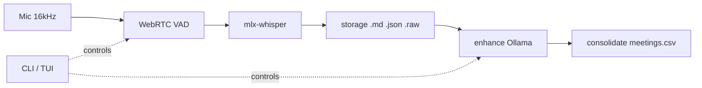

# podscribe

Podscribe is a Local-first Live Transcription and summarization tool for team meetings and 1:1s to help team leads manage different teams. 

Built from the ground up with Apple Silicon in mind.

Use Podscribe to act as your econd pair of eyes and help manage your pods/teams effectively 

In a nutshell:

mic → VAD → mlx-whisper → markdown · fully on your machine · no cloud.

VAD (Voice Activity Detection) is a foundational AI technology used in live transcription to determine exactly when a human starts and stops speaking. It acts as an audio "traffic controller," filtering out background noise and only sending actual human speech to the transcription model.

## How it works



See [`docs/ARCHITECTURE.md`](docs/ARCHITECTURE.md) for the full module-level diagram.

---

## Quick start

Requires Python 3.10+, Xcode Command Line Tools, and a working microphone.

```bash
xcode-select --install          # once, for the webrtcvad C extension

git clone <repo>
cd podscribe
python3 -m venv .venv && source .venv/bin/activate
pip install -e .

cp podscribe.yaml.example podscribe.yaml
cp leadership_team.yaml.example leadership_team.yaml
# edit leadership_team.yaml — add your team's names
# edit podscribe.yaml — set your Ollama model
```

Then:

```bash
podscribe init sam-chen --display-name "Sam Chen" --role "Senior Engineer"
podscribe record sam-chen          # Ctrl+C or 's' to stop
podscribe show sam-chen latest
```

---

## The flow

```
record  →  enhance  →  consolidate
```

| step | what it does | requires |
|---|---|---|
| `record` | live mic → VAD → Whisper → `.md` transcript, crash-safe | mic, mlx-whisper |
| `enhance` | LLM cleanup pass → `.md` summary in `summaries/` | Ollama |
| `consolidate` | extract structured fields → row in `meetings.csv` | Ollama, enhanced summary |

Each step is independent. Run only what you need.

---

## Commands

```
podscribe                              # TUI launcher (TTY only)
podscribe god [prompt]                 # agentic mode · 20+ tools · REPL or one-shot
```

### pod management

```
podscribe init <name>                  # kebab-case name, e.g. sam-chen
  --display-name "Sam Chen"
  --role "Senior Engineer"
  --cadence weekly
  --notes "private notes"

podscribe list                         # all pods · all meetings
podscribe list <pod>                   # one pod
podscribe list --all                   # uses global pods/meetings.csv
podscribe list --since 7d              # last 7 days  (also: 24h · 2026-06-15)
podscribe list --recent 5              # N most recent
podscribe list --type 1on1             # filter by type
```

### recording

```
podscribe record <pod>                 # alias: start
  --model large-v3-turbo               # default; see Models below
  --vad-aggressiveness 2               # 0 loose → 3 strict; default 2
  --device N                           # input device index
  --no-keep-audio                      # delete .raw after recording (default: keep)
  --type 1on1                          # optional; creates type/ subdir

podscribe <pod> record                 # pod-first syntax also works
```

Press `s` or Ctrl+C to stop. Transcript is written incrementally — a crash loses at most one segment.

### reading

```
podscribe show <pod> latest
podscribe show <pod> 2026-06-22        # ID prefix
podscribe search "Project Atlas"       # all pods · fixed-string match
podscribe search "auth" --pod sam-chen
podscribe search "blocker" --since 7d
podscribe search "x" --type 1on1 --color
```

Search uses `rg` if on PATH, falls back to Python. Output: `pod:DD-MMM-YYYY:<id>:[HH:MM:SS] line`.

### LLM pipeline

```
podscribe enhance <pod>                # alias: summarize · defaults to latest
podscribe enhance <pod> <id-prefix>
podscribe consolidate <pod>            # alias: cons · requires enhanced summary
podscribe consolidate <pod> <id-prefix> --no-log   # skip CSV update
```

Requires `ollama serve` at `http://localhost:11434`.

### context (glossary)

```
podscribe context <pod> add "Alice Smith" --category person
podscribe context <pod> add "Project Atlas" --category project
podscribe context <pod> remove "Alice Smith"
podscribe context <pod> list
```

Glossary terms are injected as Whisper `initial_prompt` during `record` and embedded in the LLM prompt during `enhance`/`consolidate`. Effective glossary = `leadership_team.yaml` (global) + per-pod `config.yaml`.

### config

```
podscribe config llm show
podscribe config llm set <model> <prompt-template>
podscribe config consolidate show
podscribe config consolidate set <prompt>
podscribe config god show
podscribe config god set <model>
```

### backup

```
podscribe export --out pods-backup.tar.gz
podscribe export --out -                          # stdout
podscribe import pods-backup.tar.gz
podscribe import --force pods-backup.tar.gz       # overwrite existing pods
podscribe import --dry-run pods-backup.tar.gz     # show, don't write
```

`export` bundles `pods/`, `leadership_team.yaml`, `podscribe.yaml`. Excludes `.raw`, `.env`, `__pycache__/`, `.venv/`. `import` skips `podscribe.yaml` to preserve local LLM config.

---

## TUI

Running `podscribe` at a TTY opens the two-pane modal interface:

```
SCREEN 1  —  NORMAL MODE  ·  DASHBOARD VIEW
┌─ PODS ──────┐ ┌─ Dashboard ──────────────────────────────────────┐
│ ▶ sam-chen  │ │ Sam Chen  ·  Senior Engineer  ·  weekly          │
│   alex-tan  │ │                                                  │
│   priya-k   │ │  TOTAL MEETINGS   ENHANCED       LAST MET        │
│             │ │  12               9  75%          3d ago         │
│             │ │                                                  │
│             │ │  RECENT MEETINGS                                 │
│             │ │  ▶  2026-06-27 14:02  [1on1]   42m  ✓ enhanced   │
│             │ │     2026-06-20 09:15  [1on1]   38m  → raw        │
└─────────────┘ └──────────────────────────────────────────────────┘
 NORMAL   sam-chen  ·  12 meetings  ·  last 3d ago
```

| key | action |
|---|---|
| `j` / `k` | move down / up |
| `Tab` | switch pane (PODS ↔ main) |
| `r` | record new meeting |
| `e` | enhance selected meeting |
| `c` | consolidate selected meeting |
| `Enter` | view transcript |
| `/` | search |
| `:` | command palette |
| `q` | quit |

Status bar colour: **lilac** = NORMAL · **pink** = recording/streaming · **peach** = command palette.

---

## God mode

```
podscribe god                          # interactive REPL (TUI)
podscribe god "what did sam say about the API last week?"
podscribe god --model llama3.2:3b
```

Two-pane view: left = conversation, right = tool call log. The agent has access to all pod data and can record, enhance, consolidate, and search on your behalf. Capped at 10 tool-calling turns per prompt. Type `/exit` to quit the REPL.

---

## Storage layout

```
leadership_team.yaml                       — global glossary (gitignored)
podscribe.yaml                             — LLM + god config (gitignored)
pods/
├── meetings.csv                           — global rollup (all pods)
└── <pod-name>/
    ├── config.yaml                        — metadata · glossary · optional llm
    ├── meetings.csv                       — per-pod rollup (written by consolidate)
    ├── transcripts/
    │   └── DD-MMM-YYYY/
    │       └── [<type>/]                  — e.g. 1on1/ (optional, when --type used)
    │           ├── <meeting-id>.md        — incremental transcript · [HH:MM:SS] lines
    │           ├── <meeting-id>.json      — metadata sidecar
    │           └── <meeting-id>.raw       — raw audio (kept by default)
    └── summaries/
        └── DD-MMM-YYYY/
            └── <meeting-id>.md            — enhanced output (written by enhance)
```

Meeting ID format: `YYYY-MM-DD-HHMMSS-<pod-name>` (e.g. `2026-06-27-143012-sam-chen`).  
2-level and 3-level transcript layouts coexist; `list` and `search` discover both.

---

## Models

Default: `large-v3-turbo` (~500 MB, cached in `~/.cache/huggingface/` after first use).

| short name | HuggingFace path |
|---|---|
| `base` | `mlx-community/whisper-base-mlx` |
| `turbo` | `mlx-community/whisper-large-v3-turbo` |
| `large-v3-turbo` | `mlx-community/whisper-large-v3-turbo` |

Any other value passes through to `mlx-whisper` unchanged — full HF paths work.

---

## LLM config

Lives in `podscribe.yaml` (project-level) or per-pod `config.yaml`. Pod-level takes precedence.

```yaml
llm:
  model: qwen2.5:7b
  preserve_speakers: true        # default true; prepends speaker-preservation preamble
  prompt_template: |
    You are cleaning up a raw meeting transcript. {{glossary}}
    Fix punctuation, remove filler, preserve speaker names.
    Transcript: {{transcript}}
```

`consolidate` uses a separate prompt under `consolidate.prompt` (supports `{{summary}}`).  
`god` uses `god.model`, falling back to `llm.model`.

---

## VAD tuning

`--vad-aggressiveness` controls the silence detector:

| value | behaviour |
|---|---|
| `0` | very loose — passes noise, more false segments |
| `1` | loose |
| `2` | **default** — balanced |
| `3` | strict — clear speech only; may clip soft-spoken starts |

Start at `2`. Garbage/hallucinated segments on pauses → raise to `3`. Words clipped at sentence starts → lower to `1`.

---

## Privacy

- **All processing local.** No network calls during `record` or `enhance`.
- **Raw audio kept by default** for future diarization. Use `--no-keep-audio` to delete.
- **Config files are gitignored.** `podscribe.yaml` and `leadership_team.yaml` contain real names and personal settings. Copy from the `.example` files to set up.
- **`pods/` is gitignored.** Transcripts and summaries never leave your machine.

---

## Troubleshooting

**`No module named webrtcvad`** — `xcode-select --install` then `pip install webrtcvad`.  
**`No module named sounddevice`** — `pip install sounddevice`. Linux may need `portaudio19-dev`.  
**Model download slow** — first run fetches ~500 MB. Cached after that.  
**Choppy transcript** — try `--vad-aggressiveness 3`.  
**Hallucinations on pauses** — VAD too loose; raise aggressiveness.  
**Wrong input device** — `python -c "import sounddevice; print(sounddevice.query_devices())"` then `--device N`.  
**Crashed mid-meeting** — transcript is written incrementally; run `podscribe show <pod> latest`.  
**Ollama not reachable** — `ollama serve` must be running for `enhance`, `consolidate`, and `god`.

---

## Tests

```bash
pytest tests/ -v                      # all tests (208 collected)
pytest tests/ -k "not transcriber"    # skip network smoke test (recommended for CI)
```

Offline tests need no mic or model. The single smoke test (`test_transcriber_accepts_initial_prompt`) downloads a real Whisper model.

---

## License

MIT
