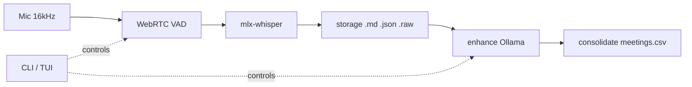
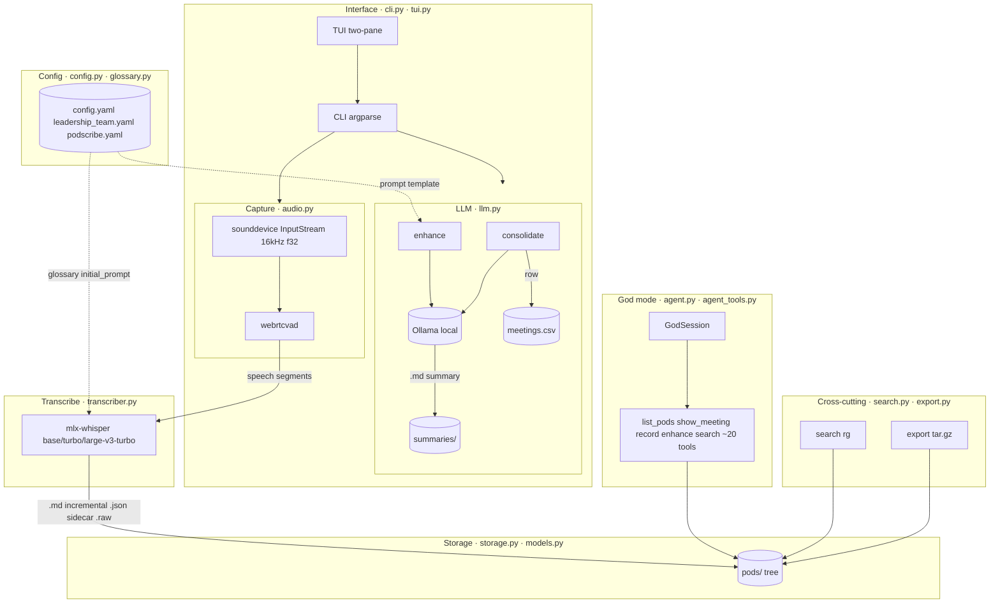

# Architecture

Podscribe is a single-package Python CLI for local-first live transcription on
Apple Silicon. Everything runs on-device; no network calls during `record` or
`enhance`. This document maps the modules, their responsibilities, and the data
that flows between them.

## Pipeline

## Modules

### Capture — `podscribe/audio.py`
sounddevice InputStream (16kHz mono float32) feeds webrtcvad frame-by-frame.
Speech segments are emitted as numpy arrays.

### Transcription — `podscribe/transcriber.py`
`Transcriber` wraps mlx-whisper. `base`, `turbo`, `large-v3-turbo` resolve to
HuggingFace MLX repos via `MODEL_MAP`. Raw float32 in, segment dicts out.

### Storage — `podscribe/storage.py` · `podscribe/models.py`
Writes per-meeting `.md` (incremental transcript), `.json` (sidecar metadata),
`.raw` (audio, kept by default). `meetings.csv` rollup per pod + global.
`list_meetings` globs both 2-level and 3-level transcript layouts.

### LLM — `podscribe/llm.py`
Headless core: `build_enhance_prompt`, `build_consolidate_prompt`, `chat_stream`.
Fires `on_token` / `on_stats` / `on_retry` callbacks; caller owns rendering.
Uses Ollama `/api/generate` for enhance/consolidate, `/api/chat` for god mode.

### Config — `podscribe/config.py` · `podscribe/glossary.py`
Three layers: `leadership_team.yaml` (global glossary), per-pod `config.yaml`,
`podscribe.yaml` (project LLM + consolidate + god). Effective glossary is
cached per process by mtime + identity.

### God mode — `podscribe/agent.py` · `podscribe/agent_tools.py`
`GodSession` runs an agentic loop via `llm.chat_stream` with tool dispatch.
Tools operate on real pod data: `list_pods`, `show_meeting`, `start_recording`,
`enhance`, `consolidate`, `search`, filesystem ops. Capped at 10
tool-calling turns per prompt.

### Interface — `podscribe/cli.py` · `podscribe/tui.py`
`cli.py` owns argparse, `rewrite_argv` (pod-first syntax), and every command
handler. `tui.py` is lazy-imported and owns the two-pane modal interface
(launcher, live record view, enhance/consolidate streams, god REPL).

### Cross-cutting — `podscribe/search.py` · `podscribe/export.py`
`search.py`: fixed-string match across transcripts (rg backend, Python fallback).
`export.py`: path-traversal-safe tar.gz bundling of `pods/` + root YAMLs.

## Data flow

